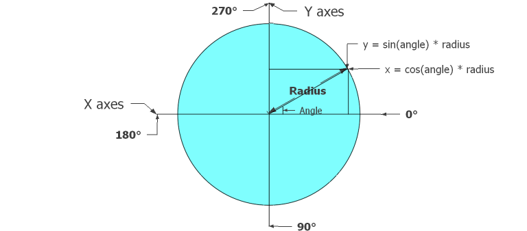

SDL2_gfxutils presentation
==========================

:library: **SDL2_gfxutils**
:version: 2.0.0
:platform: **Linux**, **Windows** and **Posix** compliant (not tested).
:compiler: **gcc**, **g++**, **clang**, **mingw32**, **mingw-w64-686**, **mingw-w64-x86_64**.
:synopsis: **SDL2_gfxutils** a **SDL2_gfx** forms generating and manipulating helper functions set
:Licence: GPLv3
:author: Eddie Brüggemann <mrcyberfighter@gmail.com>

SDL2_gfxutils brief history
---------------------------

**SDL2_gfxutils** is issue from an collection of functions that i have implemented over the years, everytime i had a idea of a form to generate i try to implemented it as a function generating the sequence of coordinates or performing operations on a form.
At start i implemented my ideas with the *python pygame* module, which is based on the **SDL** library, by start i get only the functions to set a pixel according the a radius and an angle offset, so **SDL2_gfxutils** is a translation of *python* functions into the **C** language and the **SDL2_gfx** standart.

**SDL2_gfxutils** has been entirely rewritten after the first version release which suffers under severals bugs and was not handy to use, mostly for animations.

:note: After the disaster everything are right.

The new implementation from SDL2_gfxutils
+++++++++++++++++++++++++++++++++++++++++

All forms generating functions now return a **pointer** on a specific **SDL2_gfxutils** type compatible with the generic **SDL2_gfxutils** `Form` type.

The **pointers** permit to **manipulate** the forms for **transforming** or **animating** (*rotating*, *scaling*, *translating*, *mirroring*) functions **easily**.

The **pointers** can be destroyed at your convienence of course. And this mechanic is massively used in form generating functions. So that no memory space is lost.

The generic `Form` type has been change to contains coordinates from type `float`, instead of type `int16_t`, so that the **computation** like *rotating*, *scaling*, *translating*, *mirroring* are now exactly executed.

The subtype `Pixel` members are now from type `float`.

+ Some functions have been removed because they become useless, because of the new pointers system.

+ Some functions have been added for replacing the missing features, with many advantages, mostly for transforming or animating forms in the SDL2 mainloop.

+ All functions have been improved, favor of the pointers mechanic.

SDL2_gfxutils presentation
--------------------------

**SDL2_gfxutils** is en extension for the **SDL2_gfx** library helping you for the creation of the fantastics drawing your brain can imagined.

**SDL2_gfxutils** provide severals functions for severals usages:

  + A lot of forms generating functions, from the simple **polygons**, through **stars**, to the fantastic **fractals**.

  + High-level Transforming or animating functions (*rotating*, *scaling*, *translating* and *mirroring*) acting on an entire `Form`.

  + Low-level Transforming or animating functions (*rotating*, *scaling*, *translating* and *mirroring*) acting on a single `Pixel`.

  + Memory management and check functions.

:note: I think it's **easy to adapt the SDL2_gfxutils** library to be compatible with **others libraries** than the **SDL2 library**. It is sufficient to adapt the displaying functions (the only which **require** the **SDL2_gfx library** functionalities).

Operations functions which transform a form:
++++++++++++++++++++++++++++++++++++++++++++

- **Rotation** of a `Form` around his center from the wanted **degrees**.

- **Scaling** of a `Form` from the wanted **factor**.

- **Translation** of a `Form` from the wanted `x` and `y` values.

- **Mirroring** over the `X` or `Y` **axes** according to an `center` **point**.

Form setters functions which change the settings of a form
++++++++++++++++++++++++++++++++++++++++++++++++++++++++++

- Setting a new `center` of a `Form` with optionally translating all coordinates.

- Setting a new `radius` what equal to scaling a `Form` except that instead a factor you can set a new size directly.

- Setting a new `color` for the `Form` or a `Line`.

Form getters functions to get settings of a form
++++++++++++++++++++++++++++++++++++++++++++++++

- Getting the current `Form` `center` value.

- Getting the current `Form` `color`.

- Getting the current `Form` `length` (often the **radius**).

- Getting the current `Form` `orientation` (**offset** defining the incline of a `Form`).

- Getting the current `Form` `real_length` (value defining the **distance** between the `center` and the **most distant coordinate** from the `center`).

  :note: You can use this member to build bounding boxes for collision detection per example.

Displaying forms functions
++++++++++++++++++++++++++

Each `Form` type has specific displaying functions.

Use each `Form` specific displaying function else the result will be undefined.

:note: But you can use the displaying function you want to display a `Form`, something the output is surprising.

:note: For every displaying function it exist a `thickness setttable displaying function` and an `anti-aliasing displaying function` except for the filled forms functions.

Length and middle Between 2 Pixels
++++++++++++++++++++++++++++++++++

- Measure of the length of a `Line`.

- Get the Middle `Pixel` of a `Line`.

Angles
------

In the 2D display from SDL2: the **X axes** goes from left to right and the **Y axes** from up to down.

For the multiple used `orientation` parameter from type `float`. Sea the following image to become acquainted with the values and with the conventional angle values.

:note: You can sea that 3 o'clock represent 0 degrees.

Animations advice
-----------------

Polygon and forms are not only displayable object but can also be an guideline for the execution of an animation which moving a form trough the way of the lines from the polygon or the form.

**SDL2_gfxutils** provide an function `compute_trajectory()` with which you can construct an moving line
by moving a form through the pixels of the `positions` array by translating it with the `translate_form()` function.

Download SDL2_gfxutils
----------------------

You can find archive files for following compilers:

+ **gcc** 
  
+ **g++** 
  
+ **clang** 
  
+ **mingw32** 
  
+ **mingw-w64-i686** 
  
+ **mingw-w64-x86_64**

For Linux, Posix compliant systems (not tested) and Windows at the `libSDL2_gfxutils homepage <http://www.open-source-projects.net/libSDL2_gfxutils/libSDL2_gfxutils_presentation.html>`_.  

SDL2_gfxutils Documentation License
-----------------------------------

This documentation is licensed under the Creative Commons Attribution-NonCommercial 4.0 International License.

To view a copy of this license, visit <http://creativecommons.org/licenses/by-nc/4.0/>.

.. image:: ./by-nc.png

SDL2_gfxutils License
---------------------

:note: SDL2_gfxutils is under copyright from the GNU General Public License.

**SDL2_gfxutils** a **SDL2_gfx** forms generating and manipulating helper functions set.

Copyright (©) 2016 Brüggemann Eddie <mrcyberfighter@gmail.com>.           
                                                                        
**SDL2_gfxutils** is free software: you can redistribute it and/or modify         

it under the terms of the GNU General Public License as published by    

the Free Software Foundation, either version 3 of the License, or       

(at your option) any later version.                                     
                                                                        
**SDL2_gfxutils** is distributed in the hope that it will be useful,              

but WITHOUT ANY WARRANTY; without even the implied warranty of          

MERCHANTABILITY or FITNESS FOR A PARTICULAR PURPOSE. See the            

GNU General Public License for more details.                             
                                                                        
You should have received a copy of the GNU General Public License       

along with **SDL2_gfxutils**. If not, see <http://www.gnu.org/licenses/>          

Credits
-------

Thanks to my **mother**, **my family** and **the doctors**.

**Stay away from drugs:** drugs **destroy** your *brain* and your *life*.
